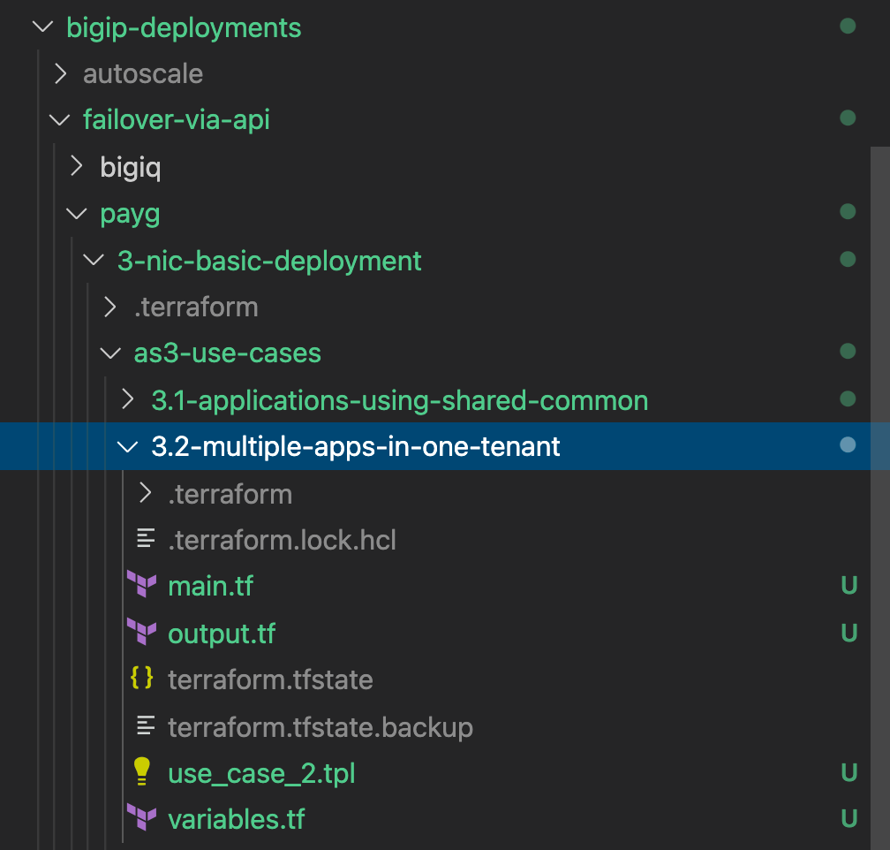
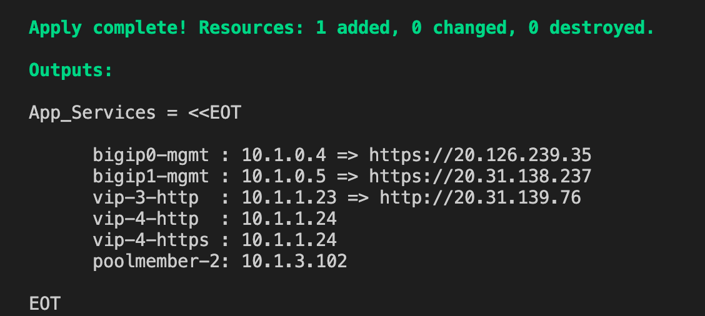
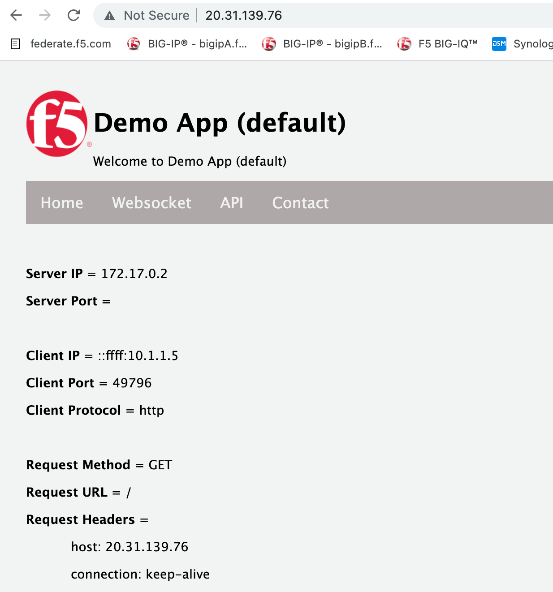
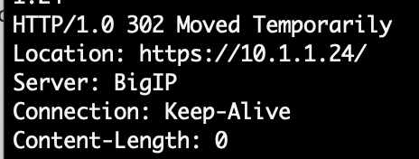
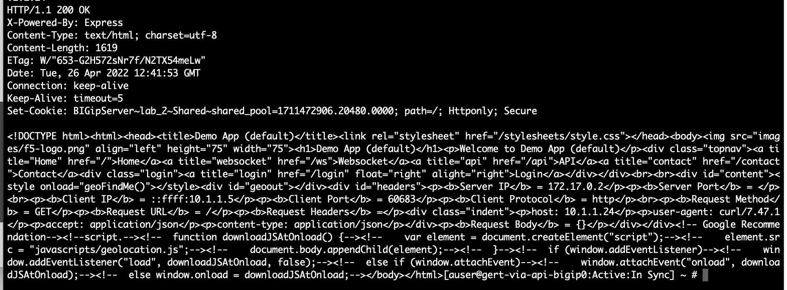
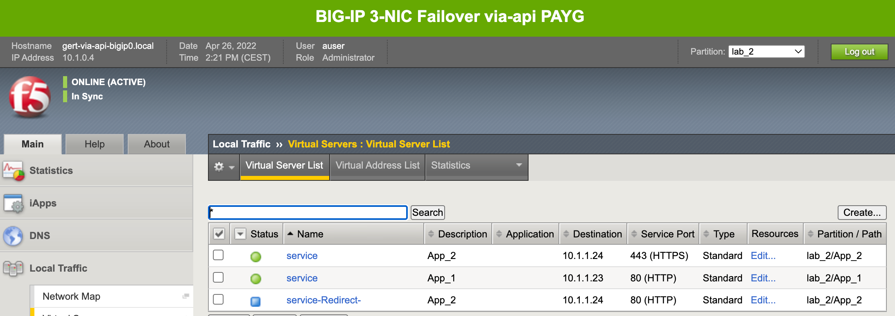

# 3.2 - Deploy multiple application in one tenant

According to the AS3 'best practices' it is preferrable to keep the number of applications in one tenant to a minimum. AS3 processes each tenant separately, but applications in one tenant are all part of the same AS3 process soon as a modification within that tenant happens.

## Use Case
Moving from object-based configuration management by using GUI or CLI the ADC admin gets more demand to start to leverage the BIG-IP API capabilities. To group applications belonging to the same group should be gathered in the same partition.

**Step 1:** Open Visual Studio Code (VSC) and open folder **3-nic-basic-deployment > as3-use-cases > 3.2-multiple-apps-in-one-tenant**.



**Step 2:** Select **use_case_2.tpl** and checkout the AS3 declaration and notice that different vips and poolmember are being used.

Questions:
* Where will de pool being declared once deployed by AS3?
* How many apps are about to get deployed?
* From which partition are the SSL .crt and .key getting declared from?

**Step 3:** Select **main.tf** and walk through it.

Notice:
* This main.tf is quite simular to the main.tf in the previous task.

**Step 4:** Go to the VSC terminal and go to folder **3.2-multiple-apps-in-one-tenant/** and use the following terraform cmds.

* **terraform init**
* **terraform plan**
* **terraform apply -auto-approve**

**Step 5:** Use generated Terraform output to test vip-3.



Check application vip-3:



**Step 6:** SSH into one of the BIG-IPs to test vip-4.

Note: You can use the jumphost for SSH or use your own laptop, whatever feels okay.

* From the jumphost **ssh azureuser@(your-bigip0-mgmt-pub-ip)** say yes to store the fingerprint and type the BIG-IP password.
* Once logged into the BIG-IP you will be at **bash** level, if you happen to be on **tmsh** just type **bash** to get to shell level.
```
Test HTTP: 
curl -i -H "Accept: application/json" -H "Content-Type: application/json" -X GET http://10.x.1.24

where 'x' = your student_number
```



Question: you are getting a redirect why?

```
Test HTTPS:
curl -isk -H "Accept: application/json" -H "Content-Type: application/json" -X GET https://10.1.1.24
```



**Step 6:** Go to the BIG-IPs by using the and login via the GUI and check the deployed AS3 declaration.

Check the deployed partitions:


Check the Virtual Servers per partion:



Checkout the pool and poolmember:


**Step 7:** Don't delete the AS3 deployed applications.

## Use Case Summary
It shouldn't be a suprise that this task can easily accomplished and an AS3 declaration is able to deploy multiple different applications into one tenant to accomodate some logical representation like eg. production, test/development, etc.

[PREVIOUS](module_3/tas3_1.md)      [NEXT](module_3/task3_3.md)